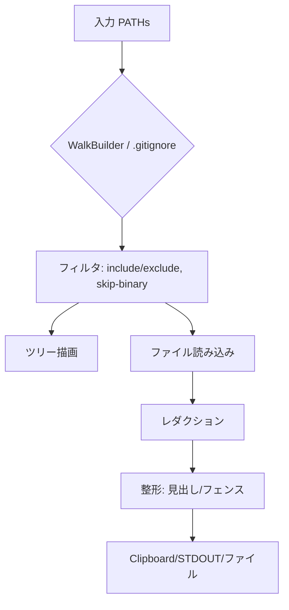

# “copytree” 開発ドキュメント（クロスプラットフォーム）

> 目的：プロジェクトのディレクトリ構造（tree）と各ファイル内容をまとめ、**LLM入力やレビュー用途に最適化**した形で**クリップボード**（または標準出力/ファイル）に出力するクロスプラットフォームCLIを提供する。

---

## 1. 設計方針と技術選定

### 1.1 言語選定
- **Rust** を採用。
  - **理由**：
    - 単一バイナリ配布（Windows/macOS/Linux）で依存関係が少ない。
    - `.gitignore` 処理を簡潔に実装できる `ignore` クレートの存在。
    - パフォーマンス・信頼性・移植性が高い。
    - `arboard` でクリップボード連携が可能。

### 1.2 プロダクト名
- **`copytree`**
  - Python 標準関数と同名だが、CLIツールとしても直感的。
  - 構造と内容を「コピーする」という動作を一目で伝えられる。

---

## 2. コア機能（MVP）

1. **パス入力**：1つ以上のディレクトリ/ファイルを対象指定。
2. **`.gitignore` 準拠**（デフォルト有効）。
3. **拡張除外**：`-x` または `--exclude` で glob パターンを指定可能（tree には表示しつつ内容は出力しない）。
4. **自動除外**：`__pycache__`, `.git`, `.venv`, `*.png`, `*.jpg`, `*.lock` などは既定でスキップ。
5. **ツリー表示**：対象の構造を先頭に表示。
6. **ファイル見出し**：各ファイルを `--- <path> ---` の見出しで区切る。
7. **サイズ・件数ガード**：ファイルあたり・全体の上限を設定可能。
8. **改行正規化**：LF 統一。
9. **出力先**：クリップボード（既定） / 標準出力 / ファイル指定。
10. **オプション出力**：コードフェンス、チャンク分割、レダクションなど。

---

## 3. CLI 仕様

```text
copytree [PATH ...] [OPTIONS]
```

### 主なオプション
- `-x, --exclude <glob>` : 除外パターン（複数指定可．tree のエントリは残し，本文をスキップ）
- `--include <glob>` : 特定のファイルのみ対象
- `--no-gitignore` : `.gitignore` を無視
- `--skip-binary` : バイナリファイルを除外（既定）
- `--max-file-bytes <N>` : ファイルごとの上限
- `--max-total-bytes <N>` : 全体の上限
- `--stdout` : 標準出力へ
- `--out <path>` : ファイル出力
- `--fence backticks|tildes|none` : コードフェンス形式
- `--redact <regex>` : 機密情報をマスク
- `-v/--verbose` : 詳細表示

> Note: shells expand globs before `copytree` runs．The exclude flag now accepts the entire stretch of values until the next option, so `copytree . -x src/*` behaves as expected even without quoting．When you need to continue specifying paths after an exclude flag, insert `--` first（例：`copytree assets -x '**/*.png' -- tests`）．

---

## 4. 出力例

```text
project-root
├─ src
│  ├─ main.rs
│  └─ lib.rs
└─ README.md

--- src/main.rs ---
fn main() {
    println!("Hello, world!");
}

--- README.md ---
# Example Project
```

---

## 5. 実装概要

### 主要クレート
- `ignore` : `.gitignore` に従うファイル走査
- `arboard` : クリップボード連携
- `clap` : CLI引数解析
- `regex` : レダクション処理
- `globset` : include/exclude パターン処理

### 擬似コード
```rust
fn run(cfg: Cfg) -> Result<()> {
    let entries = walk(cfg.paths, cfg.gitignore, cfg.include, cfg.exclude)?;
    let tree = render_tree(&entries)?;

    let mut output = String::new();
    output.push_str(&tree);
    for file in entries.files() {
        if is_excluded(file, &cfg.exclude) { continue; }
        let text = read_file_safely(file)?;
        output.push_str(&format!("--- {} ---\n{}\n\n", file.display(), text));
    }

    emit_output(&output, cfg)?;
    Ok(())
}
```

---

## 6. 使い方サンプル

### 最も簡単な使い方
```bash
copytree
```

### 特定フォルダのみコピー
```bash
copytree src app -x "**/*.png" -x "**/*.lock"
```

### `.gitignore` を無視
```bash
copytree --no-gitignore
```

### 標準出力に出す
```bash
copytree --stdout > snapshot.txt
```

---

## 7. 今後の拡張
- `--chunk` オプションによるLLM向け分割出力
- JSON出力 (`--format jsonl`)
- Git差分モード (`--git-diff HEAD..`)
- 機密情報の自動検出・レダクション

---

## 8. 開発構成例
```
copytree/
├─ Cargo.toml
├─ src/
│  ├─ main.rs
│  ├─ args.rs
│  ├─ walker.rs
│  ├─ output.rs
│  └─ redact.rs
└─ tests/
```

---

## 9. Mermaid 図

